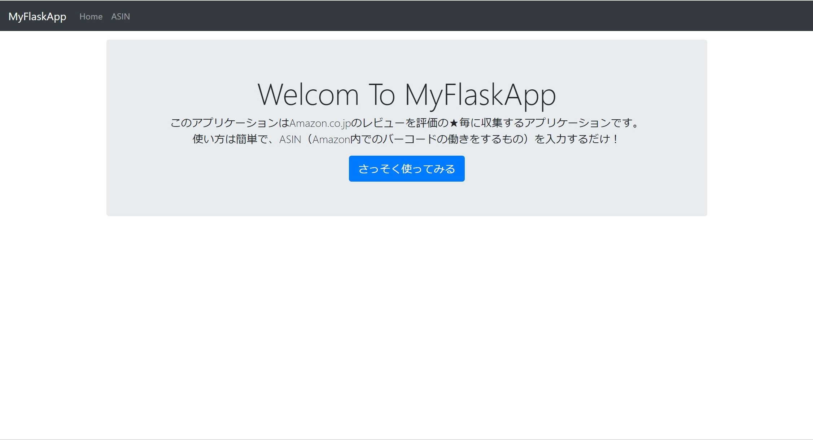
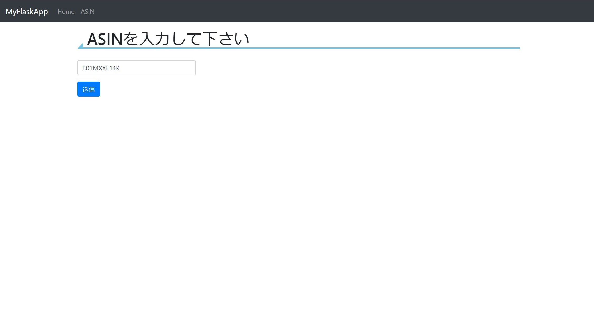
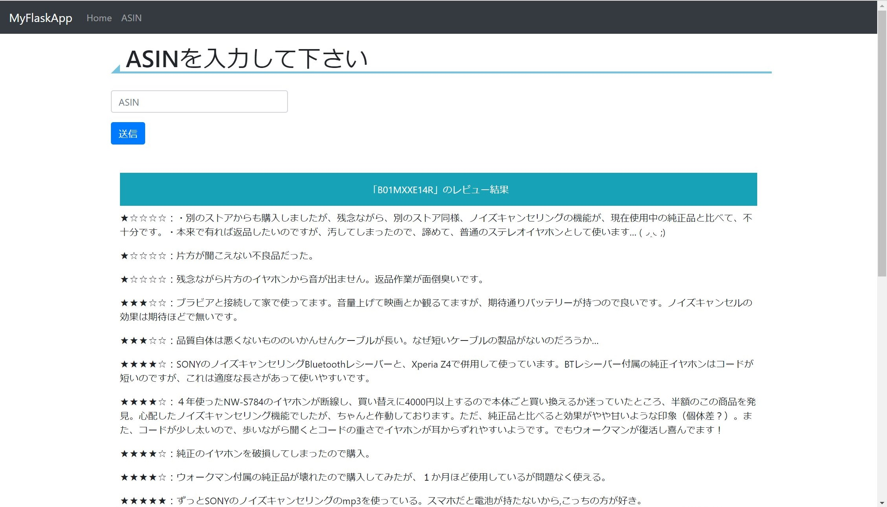

Amazon Review Scraper with Flask
====

Amazonのレビューを簡単に収集できるWebアプリケーションです。

## Description
ASIN（Amazonの商品コード）を入力すると、当該製品のレビューを取得し一覧で表示します。

1ページにまとまっているのでスッキリとしたレビューを見ることができます。  

文章要約APIと組み合わせ、レビューの★毎に内容を要約することで瞬時に製品の長所から短所までの特徴を把握するアプリケーションを作成したりすることもできるかと思います。  
その他APIとの連携を考えた土台となるアプリケーションです。

## Demo
<kbd></kbd>
<kbd></kbd>
<kbd></kbd>

## Requirement
- Python3 or more

## Usage
`python3 myflaskapp.py`  
で実行した後、例えばlocalhostなら  
`http://localhost:5000/`  
にアクセスすることで実行可能です。

## Author

[nekunet](https://github.com/nekunet)